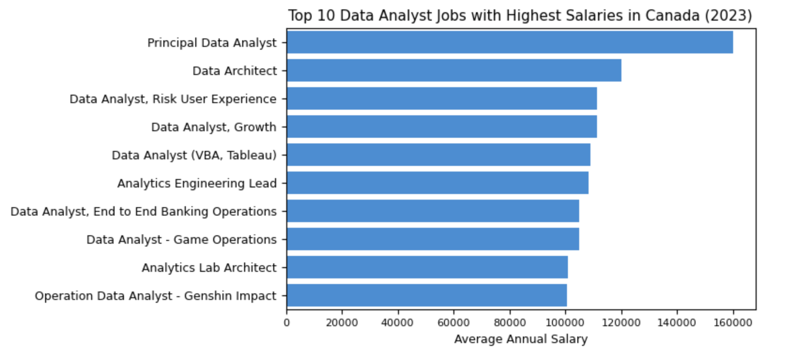
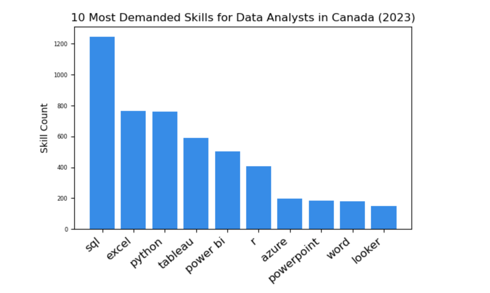
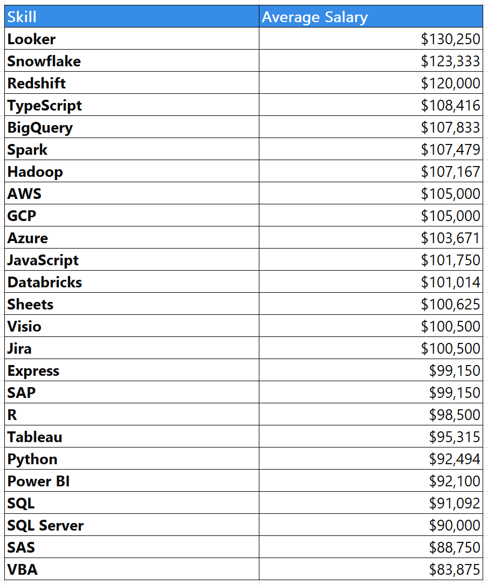
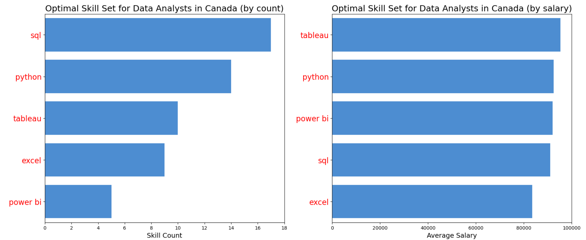

# Introduction
This project focuses on analyzing data analyst jobs in Canada in 2023 and defining an optimal set of the top-paying and sought-after skills for a data analyst. 
SQL queries: [project_sql](/project_sql/)

# Background
The idea for the project arose from a need to identify the skills required for a data analyst in Canada that are in high demand and associated with higher salaries, thereby uncovering optimal employment opportunities and simplifying the process for other jobseekers.
Data comes from the SQL course. Link to the course: (https://www.youtube.com/watch?v=7mz73uXD9DA).

# Questions:
1. What are the top-paying jobs in data analytics in Canada?
2. What skills are needed for these top-paying jobs?
3. What skills are in high demand for data analysts in Canada?
4. Which skills are associated with higher salaries?
5. What is the most optimal skill set to learn?

# Tool
For this project, the following tools were used:
- **SQL**: querying the database;
- **PostgreSQL**: database management system for organizing and managing data;
- **Visual Studio Code**: database management and executing SQL queries;
- **Git** & **GitHub**: sharing the SQL code and analysis;
- **Python (pandas, numpy, matplotlib, seaborn)**: data visualization.

# Analysis
The SQL queries in this project provide answers for the following questions:

### 1. What are the top-paying jobs in data analytics in Canada?
In this query, the data analyst jobs were filtered by the country and the specified average annual salary. This query shows the top 10 highest-paying jobs in the field of data analytics in Canada.
```sql
SELECT
    job_id,
    job_title,
    job_location,
    job_schedule_type,
    salary_year_avg,
    job_posted_date::DATE,
    name AS company_name
FROM 
    job_postings_fact
LEFT JOIN company_dim ON company_dim.company_id = job_postings_fact.company_id
WHERE
    job_title_short = 'Data Analyst'
    AND salary_year_avg IS NOT NULL
    AND job_country = 'Canada'
ORDER BY
    salary_year_avg DESC
LIMIT 10;
```

The bar graph visualizing the top 10 salaries for data analysts was generated with Python based on the SQL query results:



```py
top_jobs = pd.read_csv('top_paying_jobs_ca.csv')
fig=plt.figure(figsize=(5,3))
axes=fig.add_axes([0,0,1,1])
sb.barplot(y=top_jobs['job_title'],x=top_jobs['salary_year_avg'], errorbar=None, orient='h', color='#378CE7')
plt.xticks(fontsize=8)
plt.yticks(fontsize=9)
axes.set_title('Top 10 Data Analyst Jobs with Highest Salaries in Canada (2023)', fontsize=11)
axes.set_ylabel('')
axes.set_xlabel('Average Annual Salary', fontsize=9)
```
**Key Highlights**:
- The highest-paying data analyst positions, ranging from $100,500 to $160,000, are offered by companies like Stripe, Sun Life, and Swiss Re.
- A certain variety of job titles exists within the field of data analytics, ranging from Data Analyst to Analytics Engineering Lead, and reflects different specializations present in the field.

### 2. What skills are needed for these top-paying jobs?
This query combines two existing tables with the top_paying_jobs CTE, that is filtered to include only positions with a non-null average annual salary, a job title 'Data Analyst', and located in Canada, and selects particular columns to retrieve information about the companies, job titles, locations, salaries, and the skills associated with each job.

```sql
WITH top_paying_jobs AS (
    SELECT
        job_id,
        job_title,
        job_location,
        salary_year_avg,
        name AS company_name
    FROM 
        job_postings_fact
    LEFT JOIN company_dim ON company_dim.company_id = job_postings_fact.company_id
    WHERE
        job_title_short = 'Data Analyst'
        AND job_country = 'Canada'
        AND salary_year_avg IS NOT NULL
    ORDER BY
        salary_year_avg DESC
    LIMIT 10
)
SELECT 
    top_paying_jobs.*, 
    skills 
FROM top_paying_jobs
INNER JOIN skills_job_dim ON top_paying_jobs.job_id = skills_job_dim.job_id
INNER JOIN skills_dim ON skills_job_dim.skill_id = skills_dim.skill_id
ORDER BY salary_year_avg DESC;
```
**Key Highlights**:

The required skills for 10 highest-paying data analyst positions vary, with a mix of technical skills such as SQL, Python, Spark, Hadoop, etc., as well as specific tools and platforms like Snowflake, Power BI, Looker, Azure, AWS, and Tableau.

### 3. What skills are in high demand for data analysts in Canada?
This query counts the occurrences of each skill for Data Analyst positions in Canada by joining the tables and filtering the results to include only job postings with a job title 'Data Analyst' and located in Canada. It provides insights into the top 10 skills most commonly required for Data Analyst positions in Canada, based on the frequency of occurrence in job postings.

```sql
SELECT 
    skills,
    COUNT (skills_job_dim.job_id) AS skill_count
FROM job_postings_fact
INNER JOIN skills_job_dim ON job_postings_fact.job_id = skills_job_dim.job_id
INNER JOIN skills_dim ON skills_job_dim.skill_id = skills_dim.skill_id
WHERE
    job_title_short = 'Data Analyst'
    AND job_country = 'Canada'
GROUP BY skills
ORDER BY skill_count DESC
LIMIT 10;
```
The bar graph visualizing the top 10 most demanded skills for data analysts was generated with Python based on the SQL query results:

 

```py
fig = plt.figure(figsize=(5,3))
axes = fig.add_axes([0,0,1,1])
axes.bar(x='skills_name', height='skill_count', data=demand_skills, color='#378CE7')
plt.xticks(fontsize=12, rotation=40, horizontalalignment='right')
plt.yticks(fontsize=6)
axes.set_title('10 Most Demanded Skills for Data Analysts in Canada (2023)', fontsize=12)
axes.set_ylabel('Skill Count')
```
**Key Highlights**:
- SQL is clearly the most frequently occurring skill, which indicates its essential role in data analysis. 
- Excel, Python, Tableau, Power BI, R, SAS, Azure, PowerPoint, and Word also appear in the list of the most valuable skills in the data analytics field reflecting the diverse technical expertise needed for success in this domain. 

### 4. Which skills are associated with higher salaries?
This SQL query retrieves the average salaries associated with different skills for Data Analyst positions in Canada, helping to identify which skills are most lucrative in the job market.
```sql
SELECT 
    skills,
    ROUND(AVG(salary_year_avg),0) as avg_salary
FROM job_postings_fact
INNER JOIN skills_job_dim ON job_postings_fact.job_id = skills_job_dim.job_id
INNER JOIN skills_dim ON skills_job_dim.skill_id = skills_dim.skill_id
WHERE
    job_title_short ='Data Analyst'
    AND salary_year_avg IS NOT NULL
    AND job_country = 'Canada'
GROUP BY skills
ORDER BY avg_salary DESC
LIMIT 25;
```

Here is a breakdown of average salaries for different skills in the data analytics field based on the query results:

 


**Key Highlights**:
- Skills such as Looker, Snowflake, and Redshift command the highest average salaries, indicating their importance and demand in the job market.
- Skills related to cloud platforms like AWS, GCP, and Azure are among the top-paying skills, which reflects the increasing adoption of cloud technologies in data analytics.
- Tools like TypeScript and JavaScript also offer competitive salaries highlighting the value of programming proficiency in the data analytics field.
- Despite the widespread use of traditional tools like SQL and Excel, with SQL being particularly valuable in data analysis, their average salaries are relatively lower compared to more specialized or advanced tools.

### 5. What is the most optimal skill set to learn?
This query identifies the skills that are some of the most demanded and high-paying skills in the field of data analysis.
```sql
WITH skills_demand AS (
    SELECT 
        skills_dim.skill_id,
        skills_dim.skills,
        COUNT (skills_job_dim.job_id) AS skill_count
    FROM job_postings_fact
    INNER JOIN skills_job_dim ON job_postings_fact.job_id = skills_job_dim.job_id
    INNER JOIN skills_dim ON skills_job_dim.skill_id = skills_dim.skill_id
    WHERE
        job_title_short ='Data Analyst'
        AND salary_year_avg IS NOT NULL
        AND job_country = 'Canada'
    GROUP BY skills_dim.skill_id
), average_salary AS (  
    SELECT 
        skills_job_dim.skill_id,
        ROUND(AVG(job_postings_fact.salary_year_avg),0) as avg_salary
    FROM job_postings_fact
    INNER JOIN skills_job_dim ON job_postings_fact.job_id = skills_job_dim.job_id
    INNER JOIN skills_dim ON skills_job_dim.skill_id = skills_dim.skill_id
    WHERE
        job_title_short ='Data Analyst' 
        AND salary_year_avg IS NOT NULL
        AND job_country = 'Canada'
    GROUP BY skills_job_dim.skill_id
)
SELECT
    skills_demand.skills,
    skill_count,
    avg_salary
FROM skills_demand
INNER JOIN average_salary ON skills_demand.skill_id = average_salary.skill_id
WHERE skill_count >=5
ORDER BY 
    skill_count DESC
LIMIT 25;
```

The bar graph visualizing the optimal skills for data analysts was generated with Python based on the SQL query results:

 

```py
fig, (ax1,ax2)=plt.subplots(nrows=1,ncols=2,figsize=(20,8))

sb.barplot(y=optimal_skills['skills'],x=optimal_skills['skill_count'], errorbar=None, orient='h',color='#378CE7',ax=ax1)
sb.barplot(y=optimal_skills2['skills'],x=optimal_skills2['avg_salary'], errorbar=None, orient='h',color='#378CE7',ax=ax2)

labels1 = ax1.get_yticklabels()
plt.setp(labels1, color='r', fontsize=16)
labels2 = ax2.get_yticklabels()
plt.setp(labels2, color='r', fontsize=16)

ax1.set_title('Optimal Skill Set for Data Analysts in Canada (by count)', fontsize=18)
ax1.set_xlabel('Skill Count', fontsize=14)
ax1.set_ylabel('')

ax2.set_title('Optimal Skill Set for Data Analysts in Canada (by salary)', fontsize=18)
ax2.set_xlabel('Average Salary', fontsize=14)
ax2.set_ylabel('')

ax1.set_xlim(0,18)
ax2.set_xlim(0,100000)
```
**Key Highlights**:

The data suggest that the following five trending skills are particularly essential:
- **SQL**: SQL is the most commonly requested skill among the top five skills listed. Despite its high demand, the average salary associated with SQL proficiency indicates that it is a foundational skill for data analysts but may not command the highest salaries on its own.
- **Python**: Python is highly valued for its versatility in data analysis, the data suggest that proficiency in Python may lead to slightly better compensation compared to SQL.
- **Tableau**: Despite being less frequently requested than SQL and Python, Tableau skills are associated with a higher average salary which indicates that expertise in data visualization tools like Tableau can be financially rewarding for data analysts. 
- **Power BI**: Similar to Tableau, Power BI skills are associated with a relatively high average salary, indicating that proficiency in either Tableau or Power BI can lead to lucrative opportunities in data analysis.
- **Excel**: Excel is a ubiquitous tool in data analysis. Excel skills are valuable, especially for data manipulation and basic analysis.

# Conclusion
In conclusion, this dataset provides the whole picture of the employment landscape for positions related to data analysis, including salary ranges and required skills. 
By pinpointing the most desirable and well-compensated skills, this project offers the following valuable insights for aspiring data analysts, job seekers, or those professionals who are looking for promotion:
- **Top-Paying Jobs**: The top-paying jobs in data analytics in Canada range from $100,500 to $160,000.
- **Skills for Top-Paying Jobs**: The top 10 highest-paying data analyst roles require a diverse range, encompassing technical proficiencies like SQL and Python, alongside specialized tools and platforms such as Snowflake, Power BI, Looker, Azure, AWS.
- **Most Demanded Skills**: SQL emerges as the predominant skill, underscoring its vital role in data analysis, while Excel, Python, Tableau, Power BI, R, SAS, Azure, PowerPoint, and Word collectively represent the broad spectrum of technical proficiencies crucial for success in data analytics.
- **Most Profitable Skills**: High-paying skills like Looker, Snowflake, and Redshift highlight their significance and demand, while cloud platform skills such as AWS, GCP, and Azure underscore the growing reliance on cloud technologies in data analytics; additionally, TypeScript and JavaScript demonstrate the value of programming proficiency in the field.
- **Optimal Skill Set for Data Analyst Job**: The data identifies SQL, Python, Tableau, Power BI, and Excel as essential skills for data analysts, with varying levels of demand and associated average salaries, emphasizing their importance in the field of data analysis. 
